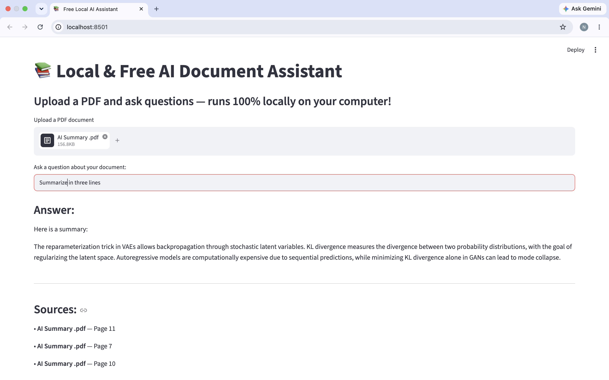

# 📚 Local AI Document Assistant

Upload a PDF and ask questions about it. The app finds the most relevant parts of your document and answers using **Llama 3.2 running locally through Ollama**.

**100% free, private, and offline.** No API key, no cloud, and your documents never leave your computer.

## Features

- 📄 Upload any PDF and chat with its content
- 🔒 Runs completely locally, so your data stays private
- 💸 No API keys or paid services
- 📌 Shows the **source file and page number** for every answer
- ⚡ Lightweight CPU embeddings (no PyTorch or GPU required)

## How It Works

This project uses **RAG (Retrieval-Augmented Generation)**:

1. The PDF is loaded and split into chunks.
2. Each chunk is converted into an embedding with FastEmbed.
3. The embeddings are stored in a Chroma vector database.
4. When you ask a question, the 4 most relevant chunks are retrieved.
5. Llama 3.2 answers using only those chunks and cites the pages they came from.

## Tech Stack

- **Interface:** [Streamlit](https://streamlit.io)
- **LLM:** Llama 3.2 via [Ollama](https://ollama.com)
- **Framework:** [LangChain](https://www.langchain.com)
- **Embeddings:** FastEmbed
- **Vector Store:** Chroma
- **PDF Loader:** PyPDF

## Getting Started

### Prerequisites

- Python 3.10 or newer
- [Ollama](https://ollama.com/download) installed and running
- About 8 GB of RAM

### Installation

**1. Clone the repository**

```bash
git clone https://github.com/YOUR-USERNAME/YOUR-REPO-NAME.git
cd YOUR-REPO-NAME
```

**2. Create and activate a virtual environment**

```bash
python -m venv venv

# macOS / Linux
source venv/bin/activate

# Windows
venv\Scripts\activate
```

**3. Install dependencies**

```bash
pip install -r requirements.txt
```

**4. Download the Llama model**

```bash
ollama pull llama3.2
```

### Run the App

Make sure Ollama is running, then start the app:

```bash
streamlit run app.py
```

Your browser will open at `http://localhost:8501`.

## Usage

1. Upload a PDF using the file uploader.
2. Wait for the "Document processed successfully!" message.
3. Type a question about the document.
4. Read the answer and check the sources listed below it.

## Notes

- The first run downloads the embedding model, so it may take a minute.
- If the answer isn't in the document, the assistant will say it doesn't know.

## Roadmap

- [ ] Support DOCX and TXT files
- [ ] Chat history
- [ ] Multiple documents at once
- [ ] Model selection from the UI

## License

MIT License

## Demo


## Author

**Nour Mahmoud Mohamed** – nourmahmoud5587~@gmail.com - https://www.linkedin.com/in/nour-mahmoud-a84590284/
